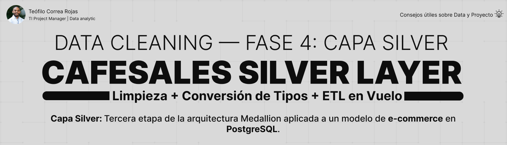

# CafeSales — Silver Layer



## 📌 Descripción

Cuarta fase y **corazón** de una serie de limpieza de datos en
PostgreSQL. Este proyecto transforma los 10,000 registros sucios de la
capa Bronze en datos limpios, tipados y validados. Los valores sucios
(ERROR, UNKNOWN, nulos) se convierten a NULL explícito, los tipos de
texto se convierten a número y fecha, y los registros incompletos se
marcan en lugar de eliminarse.

---

## 🎯 Objetivos del proyecto

- Diagnosticar los problemas de calidad antes de limpiar
- Diseñar la tabla limpia con tipos reales y constraints
- Convertir valores sucios (ERROR/UNKNOWN) a NULL explícito
- Transformar los tipos de dato (texto → número/fecha)
- Marcar los registros incompletos con record_status
- Validar la calidad final y la integridad del proceso

---

## 🏗️ Contexto — Capa Silver

```
Arquitectura Medallion
│
├── STG ← Fase 2 (datos crudos)
├── Bronze ← Fase 3 (auditoría)
├── Silver ← este proyecto (limpieza) ⭐
└── Gold ← Fase 5 (análisis)
```

La capa Silver es donde ocurre la transformación real del proyecto:
los datos dejan de ser texto sucio y se convierten en datos confiables,
tipados y listos para el análisis.

---

## 🔄 El proceso ETL — limpieza en vuelo

La transformación ocurre en el SELECT que alimenta el INSERT. Los datos
sucios nunca tocan Silver: se limpian y convierten en el camino.

```
bronze.sales (sucio, texto)
↓
SELECT con CASE + CAST (transforma en vuelo)
↓
INSERT INTO silver.sales
↓
silver.sales (limpio, tipado)
```

### Las tres transformaciones

| Transformación | Técnica | Campos |
|---|---|---|
| Limpieza de texto | `CASE` | item, payment_method, location |
| Conversión de tipos | `CASE` + `CAST` | quantity, price_per_unit, total_spent, transaction_date |
| Marcado de registros | `CASE` | record_status (active/incomplete) |

---

## 💡 Decisiones clave de esta capa

| Decisión | Razón |
|---|---|
| Limpieza "en vuelo" | Silver tiene tipos reales; el dato sucio sería rechazado |
| Orden CASE → CAST | Limpiar antes de convertir evita que CAST falle con 'ERROR' |
| Solo `transaction_id` NOT NULL | Validado sin duplicados ni nulos en el diagnóstico |
| Sucios → NULL explícito | No se inventan datos; la ausencia queda visible |
| Marcar en vez de borrar | Los registros incompletos se identifican, no se pierden |

---

## 📊 Sobre la tabla

```
silver.sales
→ 8 campos de negocio (tipados)
→ 1 campo record_status
→ 10,000 registros
```

| Campo | Tipo | Constraint |
|---|---|---|
| `transaction_id` | VARCHAR(50) | PRIMARY KEY |
| `item` | VARCHAR(100) | permite NULL |
| `quantity` | INTEGER | CHECK > 0 |
| `price_per_unit` | NUMERIC(10,2) | CHECK > 0 |
| `total_spent` | NUMERIC(10,2) | CHECK > 0 |
| `payment_method` | VARCHAR(50) | permite NULL |
| `location` | VARCHAR(50) | permite NULL |
| `transaction_date` | DATE | permite NULL |
| `record_status` | VARCHAR(20) | 'active' / 'incomplete' |

---

## ✅ Resultado de la validación

La comparación entre capas confirmó que cada valor sucio de Bronze se
convirtió exactamente en un NULL en Silver — **cero pérdida de datos**.

| Campo | Sucios en Bronze | NULL en Silver |
|---|---|---|
| item | 969 | 969 |
| quantity | 479 | 479 |
| price_per_unit | 533 | 533 |
| total_spent | 502 | 502 |
| payment_method | 3,178 | 3,178 |
| location | 3,961 | 3,961 |
| transaction_date | 460 | 460 |

---

## 🧱 Estructura del proyecto

```
CafeSales_Silver_Layer/
│
├── asset/
│ └── banner_silver.png
│
├── docs/
│ ├── data_quality_report.md
│ └── project_closure.md
│
├── sql/
│ └── 03_silver/
│ ├── diagnosis/
│ │ ├── 01_count_nulls.sql
│ │ ├── 02_count_errors.sql
│ │ ├── 03_count_unknowns.sql
│ │ └── 04_count_empty.sql
│ ├── create_tables/
│ │ └── 01_create_silver_sales.sql
│ ├── cleaning/
│ │ ├── 01_clean_text_fields.sql
│ │ ├── 02_cast_numeric_fields.sql
│ │ ├── 03_mark_record_status.sql
│ │ └── 04_insert_silver.sql
│ ├── validation/
│ │ ├── 01_validate_counts.sql
│ │ ├── 02_validate_quality.sql
│ │ └── 03_validate_record_status.sql
│ ├── README.md
│ └── data_dictionary_silver.md
│
├── .gitignore
└── README.md
```

---

## 📖 Documentación

| Documento | Descripción |
|---|---|
| [README de la capa Silver](sql/03_silver/README.md) | Reglas, ETL y decisiones de la capa |
| [Diccionario de Datos](sql/03_silver/data_dictionary_silver.md) | Tipos, constraints y transformaciones |
| [Reporte de Calidad](docs/data_quality_report.md) | Diagnóstico de problemas por columna |
| [Cierre del proyecto](docs/project_closure.md) | Resumen, resultados y lecciones |

---

## 🚀 Cómo usar

```
1. Ejecutar los scripts de diagnosis/
→ medir los problemas de calidad de Bronze
2. Ejecutar 01_create_silver_sales.sql
→ crear la tabla limpia con constraints
3. Ejecutar cleaning/04_insert_silver.sql
→ ETL que limpia y carga los 10,000 registros
4. Ejecutar los scripts de validation/
→ confirmar la carga y la integridad del proceso
```

---

## 🔜 Fases del proyecto

| Fase | Proyecto | Enfoque |
|---|---|---|
| 1 | [CafeSales_Database_Infrastructure](https://github.com/teofilocorrea/CafeSales_Database_Infrastructure) | Infraestructura ✅ |
| 2 | [CafeSales_STG_Layer](https://github.com/teofilocorrea/CafeSales_STG_Layer) | Datos crudos ✅ |
| 3 | [CafeSales_Bronze_Layer](https://github.com/teofilocorrea/CafeSales_Bronze_Layer) | Auditoría ✅ |
| 4 | CafeSales_Silver_Layer | Limpieza ← estás aquí |
| 5 | CafeSales_Gold_Layer | Modelo dimensional + análisis de negocio |

---

## 👤 Autor

### Teófilo Correa Rojas

**Project Manager Digital | Data analytic**

🔗 [LinkedIn](https://www.linkedin.com/in/teófilo-correa-rojas/)